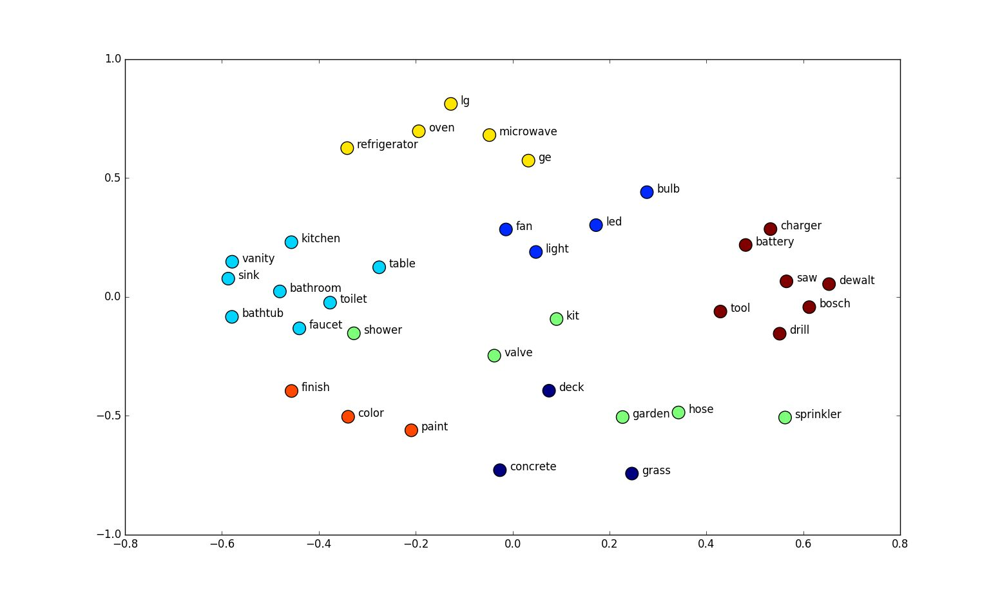
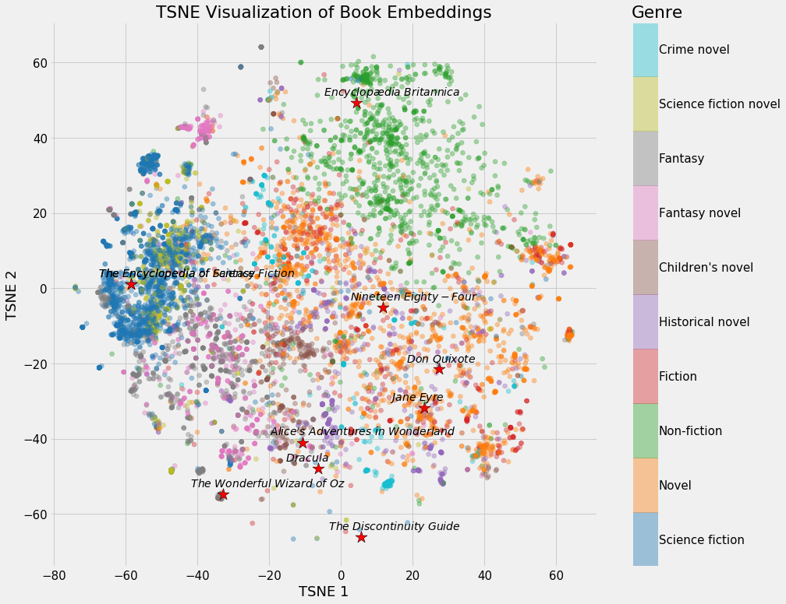
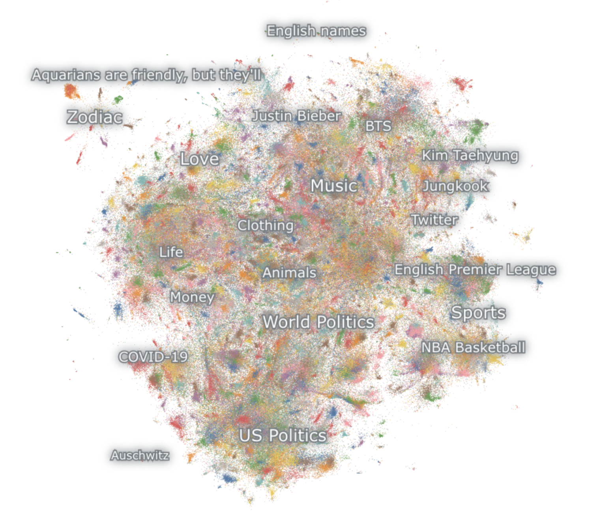
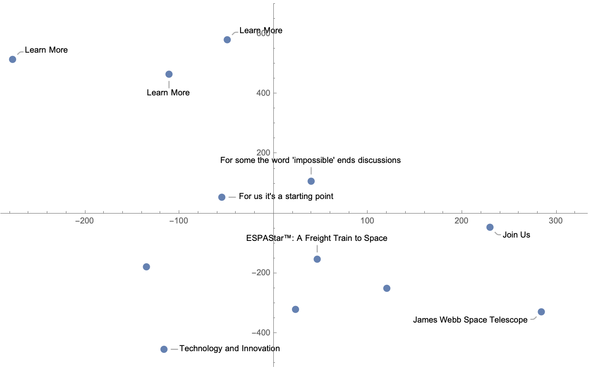

# Todos

- Log in with Infegy API and explore text scraping capabilities
- Run the euclidian distance function on a higher-dimensional feature space before reduction & plotting
- Ability combine multiple web pages from the same company into one color on graph
- Try scraping way more websites and setting up a database each so we can have persistent memory
- Use OpenAI’s embedding API to embed instead of ELMo
- Use UMAP to run dimensionality reduction

# Computers… for strategists?

Historically, Insights dealt with quantitative analysis while strategy dealt with qualitative analysis. 

Insights was responsible for running advanced statistical algorithms on survey results and turning those insights into graphs. Strategy, on the other hand, performed desk research on messaging and synthesized themes and insights with their brains.

Though computers served Insights well by processing their clean survey data with complex algorithms: Principal Component Analysis, anyone? They still couldn't really help strategists because what they dealt with was too fuzzy and ambiguous.

However, with the rise of AI, there has been a seismic shift in what computers can do. They can read poems, write prose, and analyze fuzzier and fuzzier problems. We may begin to see computing develop into a larger and larger part of strategy departments all over the world.

# What it’s good for: analyzing messaging at scale

You remember what it's like: browsing websites, writing it down, looking for trends in what you browsed and wrote down. There's only so much one strategist can do in a discovery phase.

The ideas that strategists deal with don't fit into the Principal Component Analyzers that Insights so reliably wields. They're just too fuzzy.

But what if there was a way that computers could help us yet? A way to ingest fuzzy data by the pound instead of by the ounce?

This graph plots words' meanings in what's called feature space.



You'll see that the points that are closer together are similar. You can even plot entire sentences. The technology has gotten so much better now that it's possible to plot entire books: long chapters of text.



But what happens when the UMAP algorithm and and culture collide? We'll run the top million tweets through this algorithm and plot each in feature space.



In branding, we say our clients are in trouble. Their competition is eating their lunch. If the don’t do something about it, they’ll fall behind

What if, instead of just taking their word for it, there was some kind of  data to back that up? A convincing visual, perhaps? Let’s pull from thousands of sentences their competitors have written, and show how messages—the conversation—has shifted over time?


This could be a powerful selling tool. To get more SOWs signed and, to sell ideas once we’ve gotten the business.

What other insights could we gather using this technology? How else could we apply it to more challenges to give us an edge in other domains? 

**Scrape the website…**

```mathematica
scrapeWeb[website_] :=
 (*Declare local varibles*)
 
 Module[{sesh, innerText, sentences},
  (*Declare web session 'sesh'*)
  
  sesh = StartWebSession["Chrome", Visible -> True];
  (*Run an 'OpenPage' action with URL argument 'website'*)
  
  WebExecute[sesh, "OpenPage" -> website];
  (*Run Javascript in the open web session 'sesh'
  Returns all text on site tagged as 'content'*)
  
  innerText = 
   WebExecute[sesh, 
    "JavascriptExecute" -> 
     "return document.getElementById('content').innerText"];
  If[FailureQ[innerText], Clear[innerText], Null];
  innerText = Import[website];
  (*Close web session*)
  DeleteObject[sesh];
  (*Do some cleanup*)
  sentences = DeleteCases[
    StringDelete[ 
       #,
       (*Delete these characters*)
       {",", "\"", ")", "(", "-", 
        "\[LongDash]", "\[LongDash]"}
       ]
      & /@ (*Map*)
     StringSplit[
      innerText,
      (*Break up sentences by these characters*)
      {"\n", "."}
      ],
    (*Delete empty lists*)
    ""
    ];
  Return[sentences]
  ]

sentences = scrapeWeb[#] & /@ websites;
```

### **Normalize the text…**

**Define patterns to spot and remove…**

```mathematica
testChars = {"'", "\"", "\n", "\t", "(", ")", "[", "]", "{", "}", "<",
    ">", "/", "\\", "|", "@", "#", "$", "%", "^", "&", "*", "+", "=", 
   "-", "_", ":", ";", "`", "~"};
pattern = Alternatives @@ (___ ~~ # ~~ ___ & /@ testChars);
```

**Remove stop words and remove strings that match `testChars` with a simple pattern-matching test.**

```mathematica
simpleTest = DeleteCases[StringTrim[scrapedText], ""];
stopWordsRemoved = 
  DeleteStopwords[
   StringTrim[
    Select[DeleteCases[
      Flatten[StringSplit[simpleTest, "  "]], ("" | Null)], 
     StringFreeQ[#, pattern] &]]];
```

**Test the string for only dictionary words…**

```mathematica
ContainsOnlyDictionaryWordsQ[string_] :=
 
 Module[{stringF = string, booleanList, result},
  booleanList = DictionaryWordQ /@ StringSplit[stringF];
  result = AllTrue[booleanList, TrueQ];
  Return[result];
  ]
```

**Test remaining strings for gram-length, and remove any that are less than `n`.**

```mathematica
longSentencesOnly = 
  DeleteCases[
   stopWordsRemoved, _?(WordCount[#] < 6(* <-- This is N *)&)];
```

**Instantiate the model…**

```mathematica
model :=
 Module[{net, elmo},
  (*Use the ELMo net model, trained on 1 billion words*)
  
  net = NetModel[
    "ELMo Contextual Word Representations Trained on 1B Word \
Benchmark"];
  (**)
  elmo = 
   NetFlatten[
    NetGraph[{net, 
      ThreadingLayer[(#1 + #2 + #3)/3 &]}, {Map[NetPort[{1, #}] &, 
        NetInformation[net, "OutputPortNames"]] -> 2}], 1];
  Return[elmo]; 
  ]
```

**Reduce dimensionality and plot in feature space…**

```mathematica
featureExtract[list_] := Module[{lengthList, flatList, features, xy, separated, sentences},
  lengthList = Length[#] & /@ list;
  flatList = Flatten[list];
  features = FeatureExtract[flatList, elmo];
  xy = DimensionReduce[features, 2, Method -> "TSNE"];
  separated = TakeList[xy, lengthList];
  Return[separated]
  ]

plotFeatures[xy_, sentences_] := Module[{},
  Return[ListPlot[xy -> sentences, PlotMarkers -> {Automatic, Medium},
     AxesLabel -> None]]
  ]
```



[This document is a work-in-progress. More to come!]


